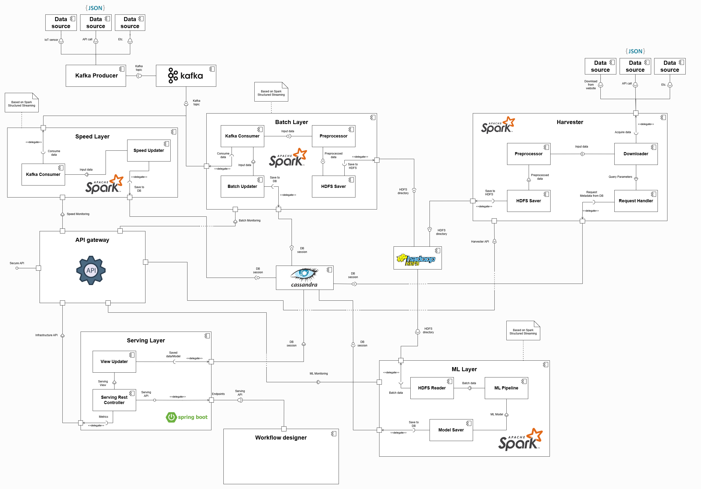

# chaM3Leon: A Modular Framework for Machine Learning Applications

A modular and scalable framework based on Java and Apache Spark, designed to support machine learning applications. ChaM3Leon emphasizes transparency, interoperability, and usability. It implements a custom Lambda architecture for real-time and batch data processing, providing a robust platform for Big Data and MLOps.

The chaM3Leon architecture is illustrated in the following Component Diagram, highlighting the connections between layers through provided and required interfaces.



## Features

*   **Modular Architecture**: Easily extend and customize layers for your specific needs.
*   **Scalable**: Built on Apache Spark to handle large-scale data processing.
*   **Lambda Architecture**: Combines batch and speed layers for efficient data handling.
*   **Extensible**: Add new layers and components to your application with ease.
*   **Multiple Layers**: Includes Batch, Speed, ML, and Harvester layers for a full data pipeline.

As of now, we have released three layers (Batch Layer, Speed Layer, ML Layer and Harvester Layer). You can refer to our [roadmap](#roadmap) to see the planned release dates for other components.

## Implementation

The chaM3Leon framework is based on Java and Maven. It is designed to be modular and scalable, allowing you to easily add new layers and components to your application.

Here layers can be divided into two types:
- Spark Layers:
	- Batch Layer
	- Speed Layer
	- ML Layer
	- Harvester Layer
- SpringBoot Layer:
	- Serving Layer

### Spark Layers

Spark Layers are based on Apache Spark with Java 11 and are designed to run on a Spark cluster. They are implemented using the Spark Streaming API and the Spark SQL API.

To implement your own version of any Spark Layer you have to:

- Build the project running at the level of the chaM3Leon pom.xml the following command:

```bash
mvn clean install
```

- Generate a Maven project and add the chaM3Leon layer you want to implement as dependency on your maven pom.xml as below:

```bash
<dependency>
	<groupId>com.smartshaped.chameleon</groupId>
	<artifactId>{layer}</artifactId>
	<version>1.0.0</version>
</dependency>
```

- Where {layer} can be:
    - batch
    - speed
    - ml
    - harvester

- Add the maven-shade-plugin to generate a shaded jar in order to submit your layer implementation as a Spark application (keep in mind the framework is based on Java 11)

```bash
<build>
	<plugins>
		<plugin>
			<groupId>org.apache.maven.plugins</groupId>
			<artifactId>maven-shade-plugin</artifactId>
			<version>3.6.0</version>
			<executions>
				<execution>
					<phase>package</phase>
					<goals>
						<goal>shade</goal>
					</goals>
					<configuration>
						<filters>
							<filter>
								<artifact>*:*</artifact>
								<excludes>
									<exclude>META-INF/*.SF</exclude>
									<exclude>META-INF/*.DSA</exclude>
									<exclude>META-INF/*.RSA</exclude>
								</excludes>
							</filter>
						</filters>
						<transformers>
						  <transformer                                                    
              				implementation="org.apache.maven.plugins.shade.resource.ManifestResourceTransformer">
              				<manifestEntries>
                				<Specification-Title> Java Advanced Imaging Image I/O Tools</Specification-Title>
                				<Specification-Version>1.1</Specification-Version>          
                				<Specification-Vendor> Sun Microsystems, Inc. </Specification-Vendor>
                				<Implementation-Title> com.sun.media.imageio</Implementation-Title>
                				<Implementation-Version> 1.1</Implementation-Version>       
                				<Implementation-Vendor> Sun Microsystems, Inc.</Implementation-Vendor>
                				<Multi-Release>true</Multi-Release>
              				</manifestEntries>                                            
            			 </transformer>
                         <transformer implementation="org.apache.maven.plugins.shade.resource.ServicesResourceTransformer"/>
                        </transformers>
					</configuration>
				</execution>
			</executions>
		</plugin>
	</plugins>
</build>
```

After this, you can choose to extend any of the layers following their own documentation:

- [Batch Layer](/chaM3Leon/batch/README.md)
- [Speed Layer](/chaM3Leon/speed/README.md)
- [ML Layer](/chaM3Leon/ml/README.md)
- [Harvester Layer](/chaM3Leon/harvester/README.md)

---

### SpringBoot Layer

The Serving Layer is based on SpringBoot 3.4.2 with Java 21.

To implement your own version of the Serving Layer you can follow the [Serving Layer documentation](/serving_chaM3Leon/README.md).

---

## Execution Instructions (Spark Layers)

To generate the `.jar` of your implemented layer (Batch, Speed, ML or Harvester), run the following command from your project directory:

```bash
mvn clean install
```

Then go to our [Docker repository](https://github.com/Smart-Shaped/docker_chaM3Leon) and follow the [Docker documentation](https://github.com/Smart-Shaped/docker_chaM3Leon/blob/public/README.md)

---

## Contributing

Contributions are welcome! Please feel free to submit a pull request.

## License

This project is licensed under the [Apache-2.0 license](LICENSE).

## Additional Video Resources

###	Youtube:

- [Presentation of ChaM3Leon Framework](https://www.youtube.com/watch?v=wtVyYUDlRQc)

- [ChaM3Leon demo about Batch, Speed and ML Layer](https://www.youtube.com/watch?v=UjzYc9C1krU)

- [ChaM3Leon demo about Harvester and ML Layer](https://www.youtube.com/watch?v=pwE223S0-oU)

## Roadmap

- API Gateway (To be determined)

- Workflow Designer (To be determined, probably Q3/Q4 2025)