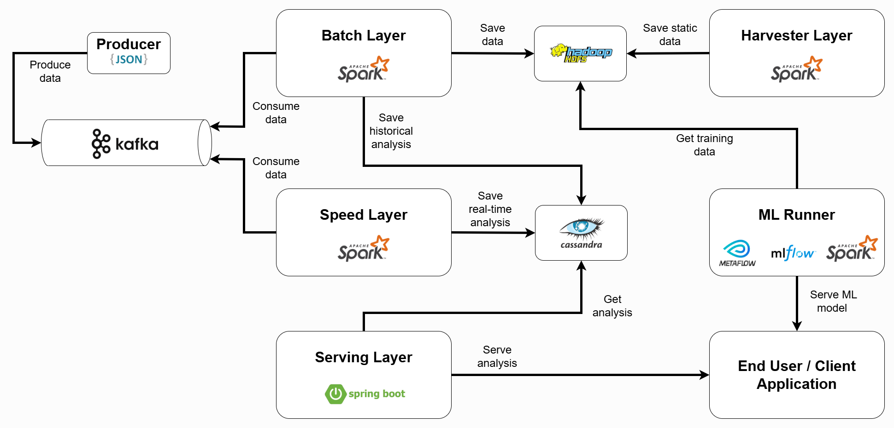

# chaM3Leon: A Modular Framework for Big Data and ML Applications

> **New to chaM3Leon?** Start with our [Executive Summary](SUMMARY.md) for a quick overview, or dive into the [Value Proposition](VALUE_PROPOSITION.md) to understand why chaM3Leon is the right choice for your Big Data projects.

A modular and scalable framework based on Java, Python and Apache Spark, designed to support machine learning applications. ChaM3Leon emphasizes transparency, interoperability, and usability. 

It implements a custom Lambda Architecture for parallel real-time (Speed Layer) and batch (Batch Layer) data processing. This design ensures both data completeness (via HDFS) and low-latency analysis (via Cassandra), providing a resilient platform for Big Data and MLOps.

ChaM3Leon emphasizes transparency, interoperability, and usability by leveraging:
- Apache Kafka for high-throughput, decoupled data ingestion.
- Apache Spark across all processing layers (Batch, Speed, Harvester) for scalable computation.
- Cassandra for storing and unifying historical and real-time analytical results.
- MLflow within the ML Runner component for seamless ML model serving and lifecycle management.
- A Spring Boot-based Serving Layer for exposing clean, unified analytical APIs.

The ChaM3Leon architecture is illustrated in the following image, highlighting the connections between layers:



---

## Complete Documentation

For comprehensive guides, tutorials, and detailed explanations, visit our **[Documentation Hub](docs/README.md)** which includes:

- **[Executive Summary](SUMMARY.md)** - Quick overview for decision makers
- **[Getting Started Guide](docs/GETTING_STARTED.md)** - Step-by-step tutorial for your first project
- **[Architecture Overview](docs/ARCHITECTURE.md)** - Understanding chaM3Leon's design (non-technical)
- **[Use Cases](docs/USE_CASES.md)** - Real-world application examples
- **[Value Proposition](VALUE_PROPOSITION.md)** - Why choose chaM3Leon
- **[FAQ](docs/FAQ.md)** - Frequently asked questions and troubleshooting
- **[Configuration Guide](docs/CONFIG_LIST.md)** - Complete configuration reference

---

## Features

*   **Modular Architecture**: Easily extend and customize layers for your specific needs.
*   **Scalable**: Built on Apache Spark to handle large-scale data processing.
*   **Lambda Architecture**: Combines batch and speed layers for efficient data handling.
*   **Extensible**: Add new layers and components to your application with ease.
*   **Multiple Layers**: Includes Batch, Speed, ML Runner, and Harvester layers for a full data pipeline.

> **Want to know more about the value proposition?** Check out our [VALUE_PROPOSITION.md](VALUE_PROPOSITION.md) for a comprehensive overview of why chaM3Leon is the right choice for your Big Data and ML projects.

As of now, we have released five layers (Batch Layer, Speed Layer, Harvester Layer, Serving Layer and ML Runner). You can refer to our [roadmap](#roadmap) to see the planned release dates for other components.

## Implementation

The chaM3Leon core framework is based on Java, Maven and Python. It is designed to be modular and scalable, allowing different components and layers to be easily integrated.

The layers can be divided based on their implementation technology:
- Java Layers (Main Framework):
	- Spark-based:
		- Batch Layer
		- Speed Layer
		- Harvester Layer
	- SpringBoot-based:
		- Serving Layer
- Python Layer (as Git Submodule):
	- ML Runner
	
> **ML Runner Documentation**: For detailed information about the ML Runner (Python layer), visit the [PyChaM3Leon repository](https://github.com/Smart-Shaped/PyChaM3Leon).

### Spark Layers

Spark Layers are based on Apache Spark with Java 11 and are designed to run on a Spark cluster. They are implemented using the Spark Streaming API and the Spark SQL API.

To implement your own version of any Spark Layer you have to:

- Build the project running at the level of the chaM3Leon pom.xml the following command:

```bash
mvn clean install
```

- Generate a Maven project and add the chaM3Leon layer you want to implement as dependency on your maven pom.xml as below:

```bash
<dependency>
	<groupId>com.smartshaped.chameleon</groupId>
	<artifactId>{layer}</artifactId>
	<version>2.0.0</version>
</dependency>
```

- Where {layer} can be:
    - batch
    - speed
    - harvester

- Add the maven-shade-plugin to generate a shaded jar in order to submit your layer implementation as a Spark application (keep in mind the framework is based on Java 11)

```bash
<build>
	<plugins>
		<plugin>
			<groupId>org.apache.maven.plugins</groupId>
			<artifactId>maven-shade-plugin</artifactId>
			<version>3.6.0</version>
			<executions>
				<execution>
					<phase>package</phase>
					<goals>
						<goal>shade</goal>
					</goals>
					<configuration>
						<filters>
							<filter>
								<artifact>*:*</artifact>
								<excludes>
									<exclude>META-INF/*.SF</exclude>
									<exclude>META-INF/*.DSA</exclude>
									<exclude>META-INF/*.RSA</exclude>
								</excludes>
							</filter>
						</filters>
						<transformers>
						  <transformer                                                    
              				implementation="org.apache.maven.plugins.shade.resource.ManifestResourceTransformer">
              				<manifestEntries>
                				<Specification-Title> Java Advanced Imaging Image I/O Tools</Specification-Title>
                				<Specification-Version>1.1</Specification-Version>          
                				<Specification-Vendor> Sun Microsystems, Inc. </Specification-Vendor>
                				<Implementation-Title> com.sun.media.imageio</Implementation-Title>
                				<Implementation-Version> 1.1</Implementation-Version>       
                				<Implementation-Vendor> Sun Microsystems, Inc.</Implementation-Vendor>
                				<Multi-Release>true</Multi-Release>
              				</manifestEntries>                                            
            			 </transformer>
                         <transformer implementation="org.apache.maven.plugins.shade.resource.ServicesResourceTransformer"/>
                        </transformers>
					</configuration>
				</execution>
			</executions>
		</plugin>
	</plugins>
</build>
```

After this, you can choose to extend any of the layers following their own documentation:

- [Batch Layer](/chaM3Leon/batch/README.md)
- [Speed Layer](/chaM3Leon/speed/README.md)
- [Harvester Layer](/chaM3Leon/harvester/README.md)

---

### SpringBoot Layer

The Serving Layer is based on SpringBoot 3.4.2 with Java 21.

To implement your own version of the Serving Layer you can follow the [Serving Layer documentation](/serving_chaM3Leon/README.md).

---

### Python Layer

The ML Runner is implemented as a Python library, managed as a Git submodule. It leverages modern MLOps tools including Metaflow, MLflow, and Apache Spark for building and managing machine learning pipelines.

To implement or extend your machine learning pipelines, you can follow the [PyChaM3Leon documentation](https://github.com/Smart-Shaped/PyChaM3Leon/blob/public/README.md).

---

## Execution Instructions (Spark Layers)

To generate the `.jar` of your implemented layer (Batch, Speed, or Harvester), run the following command from your project directory:

```bash
mvn clean package
```

Then go to our [Docker repository](https://github.com/Smart-Shaped/docker_chaM3Leon) and follow the [Docker documentation](https://github.com/Smart-Shaped/docker_chaM3Leon/blob/public/README.md)

---

## Contributing

Contributions are welcome! Please feel free to submit a pull request.

## License

This project is licensed under the [Apache-2.0 license](LICENSE).

## Additional Video Resources

###	Youtube:

- [Presentation of ChaM3Leon Framework](https://www.youtube.com/watch?v=wtVyYUDlRQc)

- [ChaM3Leon demo about Batch, Speed and ML Runner](https://www.youtube.com/watch?v=UjzYc9C1krU)

- [ChaM3Leon demo about Harvester and ML Runner](https://www.youtube.com/watch?v=pwE223S0-oU)

## Roadmap

- **Harvester in Python** (Q2 2026): Python-based implementation for more flexible data collection

- **Serving in Django** (Q3 2026): Modern web framework for API serving and web interfaces

- **Workflow Designer** (Q4 2026): Visual tool for designing and managing data pipelines without code